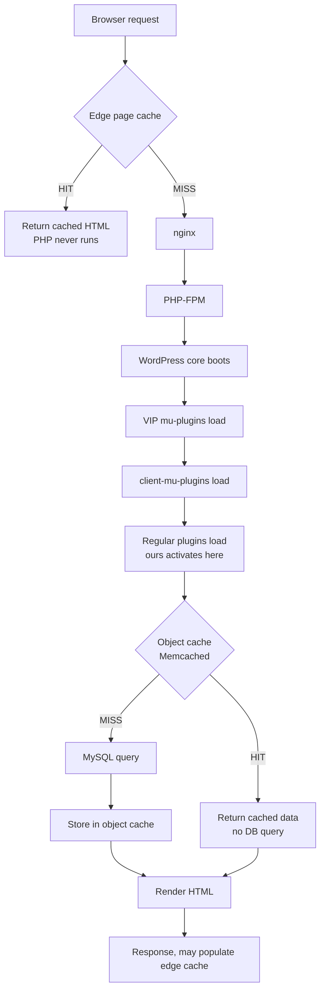
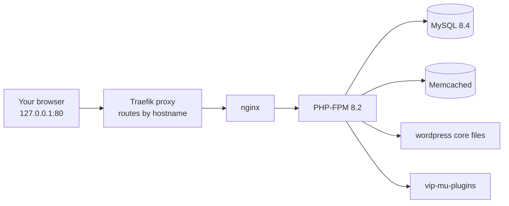

# WordPress VIP, End to End

How the platform works, what makes its code different from ordinary WordPress, and the
exact flow used to build and run this plugin locally.

Everything here was run and verified on macOS 14.4.1 with VIP-CLI 4.1.0, Docker 29.6.2,
WordPress 6.7.5 and PHP 8.2 — none of it is reconstructed from memory.

**Contents**

1. [What VIP actually is](#1-what-wordpress-vip-actually-is)
2. [How a VIP application is laid out](#2-how-a-vip-application-is-laid-out)
3. [What happens when someone loads a page](#3-what-happens-when-someone-loads-a-page)
4. [Why VIP code looks different](#4-why-vip-code-looks-different)
5. [What is actually running locally](#5-what-is-actually-running-locally)
6. [Setup from zero](#6-setup-from-zero)
7. [Creating the WordPress environment](#7-creating-the-wordpress-environment)
8. [The plugin, file by file](#8-the-plugin-file-by-file)
9. [Testing on localhost](#9-testing-on-localhost)
10. [The code review gate](#10-the-code-review-gate)
11. [Traps we actually hit](#11-traps-we-actually-hit)
12. [Cheat sheet](#12-cheat-sheet)

---

## 1. What WordPress VIP actually is

Not "expensive WordPress hosting." It's a managed platform with opinions, and those
opinions are what your code has to satisfy.

On ordinary hosting you have a server you control and WordPress is a folder of files you
edit. On VIP you have **an application that gets deployed**, running on infrastructure you
don't touch, under rules you can't opt out of. Four consequences shape everything else.

### The filesystem is read-only

Your code directory cannot be written to at runtime. No plugin installer, no theme editor,
no writing cache files to disk, no `file_put_contents()` into your plugin folder. Uploads
are the single exception, and they don't live on the web server at all — they go to
separate object storage. Code that assumes it can write next to itself breaks on VIP.

### Deployment is git, not FTP

You push to a branch; the platform builds and deploys it. There is no "log in and fix it
on production." This is why build artifacts matter — whatever the branch contains is what
runs.

### Caching is not optional, and it's layered

There's a page cache at the edge in front of everything, and a shared **Memcached** object
cache behind it. Your code is expected to cooperate with both. "It's fast enough on my
laptop" is not an argument — your laptop has one user and a warm query cache.

### Humans read your code

New code going onto the platform is reviewed by VIP engineers against a published
standard. This is why this plugin is annotated the way it is: a reviewer should never have
to guess why you did something unusual.

> **The one-line version:** VIP is WordPress where performance and safety are
> *contractual*, not aspirational. Every convention in this plugin traces back to one of
> the four constraints above.

---

## 2. How a VIP application is laid out

A VIP repo is not a WordPress install. It's the `wp-content` portion only — core is
supplied by the platform.

This is the most confusing thing for newcomers, so plainly: **you never commit WordPress
core.** You commit the application code that sits inside it. The canonical starting point
is the [`vip-go-skeleton`](https://github.com/Automattic/vip-go-skeleton) repo.

| Directory | Purpose |
| --- | --- |
| `plugins/` | Conventional plugins, activated through wp-admin. This plugin lives here. |
| `client-mu-plugins/` | Your must-use code — always on, cannot be deactivated, loads before regular plugins. For things that must never be switched off. |
| `themes/` | Your themes. The skeleton ships `twentytwentyfive`. |
| `vip-config/` | Configuration that runs very early, before WordPress finishes loading. Environment constants go here, since you don't control `wp-config.php`. |
| `private/` | Files deployed with the app but never reachable over HTTP. |
| `images/` | Static image assets shipped with the codebase, as opposed to uploaded media. |
| `languages/` | Translation files for your text domains. |

### The mu-plugins you don't own

Separately, the platform injects its own `mu-plugins` directory that you never edit and
never commit. On a running environment that includes `advanced-post-cache`,
`vip-cache-manager`, `query-monitor` and about a dozen others. The naming distinction trips
people up constantly:

| Directory | Owned by | You commit it? |
| --- | --- | --- |
| `client-mu-plugins/` | You | Yes — your always-on code |
| `mu-plugins/` | VIP | No — platform-supplied |

---

## 3. What happens when someone loads a page



The two cache layers are independent. A logged-in editor skips the edge cache entirely but
still benefits from the object cache — which is exactly the traffic this plugin's caching
serves.

**Why this shapes the plugin.** The featured-posts query sits deep inside, past both
caches. Every uncached request costs a MySQL round trip on an unindexed meta lookup. The
object cache is the layer you control from plugin code, so that's where you invest. The
edge cache handles anonymous traffic; the object cache is what saves you when fifty editors
are logged in and bypassing the edge.

---

## 4. Why VIP code looks different

Each convention exists because of a specific failure mode at scale.

### Object caching with versioned keys

The naive approach is to delete the key when data changes. That breaks the moment your key
has variables in it. Ours is `featured_v3_n5` — version 3, five posts. Ten possible `n`
values means ten keys per version. Deleting them all means ten round trips to a *remote,
shared* Memcached, plus a race condition if a write lands mid-loop.

Instead we store a version integer and increment it. One atomic operation orphans every old
key at once; they expire on their own. This matters specifically because VIP's object cache
is shared and remote — there is no "delete everything matching a prefix" operation.

```php
function bump_cache_version(): void {
	if ( false === wp_cache_incr( VERSION_KEY, 1, CACHE_GROUP ) ) {
		wp_cache_set( VERSION_KEY, 1, CACHE_GROUP );
	}
}
```

`wp_cache_incr()` returns false when the key doesn't exist yet, so we seed it. That fallback
is why this is three lines instead of one.

### Bounded queries

Every query needs an upper limit an attacker cannot raise. Ours clamps to 1–10 **before**
the number reaches the cache key — otherwise someone could request `?count=1` through
`?count=99999` and fill the shared object cache with junk. That's a cache-poisoning denial
of service, and a real review finding.

Three flags a reviewer looks for by name:

- `no_found_rows => true` — skips the second `SQL_CALC_FOUND_ROWS` counting query. Only
  needed for pagination, and we don't paginate.
- `update_post_term_cache => false` — don't pre-fetch categories and tags we never render.
- `ignore_sticky_posts => true` — prevents a second query to pull sticky posts in.

### Escape at output, never at input

Escape late, in the context where it lands. The same string needs different treatment in an
`href`, a text node, and an attribute. Escaping on save means guessing the destination, and
you'll be wrong somewhere.

| Function | Use for |
| --- | --- |
| `esc_html()` | Text between tags |
| `esc_url()` | Anything in `href` or `src` |
| `esc_attr()` | Other HTML attribute values |
| `wp_kses_post()` | Content where limited HTML is genuinely allowed |

Verified rather than assumed: a post titled `Bad <script>alert(1)</script>` rendered as
escaped entities, with zero raw script tags in the HTML.

### Sanitize every superglobal, in order

WordPress adds backslashes to `$_POST` and `$_GET` — a legacy quirk. So `wp_unslash()`
first, then sanitize. Skipping the unslash leaves stray backslashes; skipping the sanitize
gives you an injection.

```php
$nonce = isset( $_POST[ NONCE_NAME ] )
	? sanitize_text_field( wp_unslash( $_POST[ NONCE_NAME ] ) )
	: '';
```

### Nonce and capability are different checks

They answer different questions:

- A **nonce** asks *"did this request come from a form we rendered?"* — it stops CSRF. It
  does not tell you who the user is.
- A **capability check** asks *"is this user allowed to do this?"* — it stops privilege
  escalation.

You need both, and the capability check must be **per object**:
`current_user_can( 'edit_post', $post_id )`, not blanket `current_user_can( 'edit_posts' )`.
The blanket version means "can edit posts in general" — a contributor passes it, then edits
somebody else's article.

### permission_callback is mandatory

Every REST route must declare one. Omitting it triggers `_doing_it_wrong()` and is an
automatic review finding. Ours is `__return_true`, which is correct *and commented*: the
route is read-only, pinned to published posts, and returns only title, URL and excerpt —
all already public. The comment is what turns it from an oversight into a decision.

---

## 5. What is actually running locally



### Why the URL works without editing /etc/hosts

The site is at `http://vip-featured.vipdev.lndo.site/`. That looks like a public domain,
and it is one — but every hostname under `lndo.site` resolves to **127.0.0.1** by public
DNS. A real domain pointing at your own machine.

```
$ ping -c 1 vip-featured.vipdev.lndo.site
PING vip-featured.vipdev.lndo.site (127.0.0.1): 56 data bytes
```

A Traefik proxy holds ports 80 and 443 and routes by hostname, which is how you run several
VIP environments at once without port collisions.

### How your code gets inside the container

Docker *bind mounts* map host directories into the container:

| On your Mac | Inside the container |
| --- | --- |
| `~/Documents/vip-skeleton/plugins` | `/wp/wp-content/plugins` |
| `~/Documents/vip-skeleton/client-mu-plugins` | `/wp/wp-content/client-mu-plugins` |
| `~/Documents/vip-skeleton/private` | `/wp/wp-content/private` |
| `~/.local/share/vip/dev-environment/vip-featured/uploads` | `/wp/wp-content/uploads` |

Note what's *missing*: WordPress core. It lives at `/wp` inside the image and is not
mounted from disk — mirroring production, where core is the platform's concern.

> **Why we copy instead of symlink.** Bind mounts don't follow symlinks pointing outside
> the mounted directory. A symlink at `plugins/spotlight-posts` pointing to
> `~/Documents/spotlight-posts` resolves to a path the container can't see. Hence
> `rsync` — and hence re-running it after edits.

---

## 6. Setup from zero

| Tool | Why it's needed |
| --- | --- |
| Docker | Runs the containers. The whole local environment is Docker. |
| Node + npm | Installs VIP-CLI, compiles the block editor JavaScript. |
| PHP | Runs Composer and PHPCS on the host. |
| Composer | Installs the VIP coding standards. |
| git | Version control, and cloning the skeleton. |

### Docker Desktop

```bash
brew install --cask docker-desktop
```

`--cask` tells Homebrew this is a GUI app rather than a command-line formula. The cask is
`docker-desktop`; the older `docker` name no longer refers to Desktop. After installing you
**must launch the app once and accept the license** — the engine doesn't start otherwise,
and every `docker` command fails with a connection error.

### VIP-CLI

```bash
npm install -g @automattic/vip
```

`-g` installs globally, putting `vip` on your PATH rather than into a project folder.

### PHP without a system install

If you have Local by Flywheel, it bundles PHP already — point at it instead of installing
another copy:

```bash
ln -sf "$HOME/Library/Application Support/Local/lightning-services/php-8.2.29+0/bin/darwin/bin/php" \
  ~/.local/bin/php
```

`ln -s` makes a symbolic link — a pointer, not a copy. `-f` overwrites an existing link.

> **Composer permission trap.** If `~/.composer` is owned by root (a leftover from an old
> `sudo composer` run), set `COMPOSER_HOME` to a writable directory, or fix it properly with
> `sudo chown -R $(whoami):staff ~/.composer`.

> **Habit worth forming.** Run `--help` before using an unfamiliar command. Flags change
> between versions, and guessing produces confident, wrong commands.

---

## 7. Creating the WordPress environment

### Get the skeleton

```bash
git clone --depth 1 https://github.com/Automattic/vip-go-skeleton.git ~/Documents/vip-skeleton
```

`--depth 1` is a *shallow clone* — only the most recent commit instead of full history.

### Create the environment

```bash
vip dev-env create --slug vip-featured --title "VIP Featured" \
  --multisite false --php 8.2 --wordpress 6.7 \
  --app-code ~/Documents/vip-skeleton --mu-plugins demo \
  --elasticsearch n --phpmyadmin n --xdebug n --cron n --mailpit n --photon n
```

| Flag | What it does |
| --- | --- |
| `--slug` | Names the environment. Becomes the hostname and how later commands refer to it. |
| `--multisite false` | Single site rather than a network. |
| `--php 8.2` | PHP version. Accepts 8.2, 8.3, 8.4, 8.5. |
| `--wordpress 6.7` | WordPress version. |
| `--app-code <path>` | **The important one.** Points at your local skeleton clone. |
| `--mu-plugins demo` | Uses VIP's read-only platform mu-plugins image — the real ones. |
| the `n` flags | Disable optional services. Each one saves disk and RAM. |

> **`--app-code demo` will not work for plugin development.** The documented default mounts
> a **read-only** image of the skeleton. Fine for looking around, but there is nowhere to
> put your plugin. You must clone the skeleton yourself and pass its path.

### Start it

```bash
vip dev-env start --slug vip-featured
vip dev-env info  --slug vip-featured
```

First run pulls roughly 3.9 GB of images and installs WordPress; later starts take seconds.
`info` prints the site URL, database port, and a **one-click login URL** that logs you into
wp-admin without typing anything. Default user is `vipgo`.

### Load the plugin and activate it

```bash
rsync -a --exclude .git --exclude node_modules --exclude vendor \
  ~/Documents/spotlight-posts/ \
  ~/Documents/vip-skeleton/plugins/spotlight-posts/

vip dev-env exec --slug vip-featured -- wp plugin activate spotlight-posts
```

`rsync -a` is archive mode — recursive, preserving permissions and timestamps. The trailing
slash on the source matters: with it you copy the *contents*; without it you nest a folder
inside a folder.

`vip dev-env exec ... -- wp ...` reaches WP-CLI inside the container. The bare `--`
separates VIP-CLI's own flags from the command being passed through.

---

## 8. The plugin, file by file

| File | Role |
| --- | --- |
| `spotlight-posts.php` | Plugin header, constants, and every `add_action` in one place so a reviewer sees the whole surface area at a glance. |
| `includes/query.php` | The cached, bounded query. The performance-critical file. |
| `includes/meta-box.php` | Editor checkbox, meta registration, guarded save handler. |
| `includes/block.php` | Block registration and server-side rendering with escaping. |
| `includes/rest.php` | Public REST route, permission callback, argument validation. |
| `src/featured-list/block.json` | Block metadata — the source of truth both PHP and JS read. |
| `src/featured-list/index.js` | Editor UI. `save()` returns null because PHP owns the markup. |
| `.phpcs.xml` | Points PHPCS at WordPress-VIP-Go and sets the PHP version floor. |
| `composer.json` / `package.json` | The two toolchains: PHP linting, and JavaScript building. |

### Why every file starts the same way

```php
defined( 'ABSPATH' ) || exit;
```

`ABSPATH` is defined only when WordPress has booted. If somebody requests your PHP file
directly over HTTP, WordPress hasn't loaded, the constant is undefined, and the file exits
before doing anything. It belongs in **every** PHP file.

### The flag itself

Featured status is post meta under `_spotlight_featured`. The leading underscore makes it
*protected* meta — WordPress hides it from the generic Custom Fields UI, so editors use the
checkbox rather than typing raw keys.

```php
register_post_meta( 'post', META_KEY, array(
	'type'              => 'string',
	'single'            => true,
	'show_in_rest'      => false,
	'sanitize_callback' => __NAMESPACE__ . '\\sanitize_meta',
	'auth_callback'     => __NAMESPACE__ . '\\auth_meta',
) );
```

Registering means the `sanitize_callback` and `auth_callback` apply to *every* write path —
your form, WP-CLI, the REST API, another plugin. Writing meta directly only protects the
one path you remembered.

### The save handler, in guard order

Cheapest and most likely to bail out goes first:

1. **Autosave check.** WordPress fires `save_post` during autosaves too, and your form
   fields aren't present. Without this you'd wipe the flag every 60 seconds.
2. **Nonce verification.** Confirms the request came from your form.
3. **Capability check.** Confirms this user may edit *this* post.
4. **Then** read, unslash, sanitize, and write.

### Why the block is server-rendered

A *static* block saves its HTML into post content at save time. A *dynamic* block saves
nothing and generates markup on every request. Ours must be dynamic: a static block would
freeze whichever posts were featured on the day the editor placed it. So `save()` returns
`null` and PHP's `render_callback` does the work — which also means all escaping happens in
PHP, where the VIP sniffs can check it.

Registration is guarded so a fresh clone doesn't fatal before you've built:

```php
if ( ! file_exists( $block_path . '/block.json' ) ) {
	return;
}
```

### The build step

```bash
npm install
npm run build
```

`@wordpress/scripts` wraps webpack with WordPress's conventions preconfigured. It compiles
`src/` into `build/` and generates `index.asset.php`, a manifest of which WordPress
JavaScript packages your code needs, so WordPress enqueues dependencies in the right order:

```php
array( 'react-jsx-runtime', 'wp-block-editor', 'wp-blocks',
       'wp-components', 'wp-i18n', 'wp-server-side-render' )
```

> **`build/` is gitignored**, so it does not travel with a `git clone`. Anyone setting this
> up fresh must run `npm run build` or the block silently won't register.

---

## 9. Testing on localhost

### The site is already on localhost

`.lndo.site` resolves to `127.0.0.1`, so this *is* localhost — it just avoids making you
edit `/etc/hosts`. Open:

```
http://vip-featured.vipdev.lndo.site/
```

If the environment is stopped, run `vip dev-env start --slug vip-featured` first.

### Get into wp-admin

```bash
vip dev-env info --slug vip-featured
```

Copy the **LOGIN URL** and paste it into your browser — it logs you straight in. Or use
`/wp-admin` with username `vipgo` and the password from that same output.

### Test the editor experience

1. In wp-admin go to **Posts** and open any post.
2. Find the **Featured** panel in the right sidebar and tick the checkbox.
3. Click **Update**.
4. Create or edit a page, click **+**, search **Featured Posts**, insert the block.
5. In the block sidebar set a heading and post count. The preview updates live via
   `ServerSideRender` — genuinely PHP output, not a JavaScript mock-up.

### Test the REST endpoint

```bash
curl -sS "http://vip-featured.vipdev.lndo.site/wp-json/spotlight/v1/posts"
```

Then try to break the validation — all of these return HTTP 400:

```bash
curl -sS ".../wp-json/spotlight/v1/posts?count=0"
curl -sS ".../wp-json/spotlight/v1/posts?count=99"
curl -sS ".../wp-json/spotlight/v1/posts?count=abc"
```

`-sS` means silent but still show errors — suppresses the progress meter without hiding
real failures.

### Prove the caching works

```bash
vip dev-env exec --slug vip-featured -- wp eval '
$v = wp_cache_get( "cache_version", "spotlight_posts" );
echo "external cache: " . ( wp_using_ext_object_cache() ? "memcached" : "none" ) . "\n";
echo "version: $v\n";
echo "cached: " . ( is_array( wp_cache_get( "featured_v{$v}_n5", "spotlight_posts" ) ) ? "yes" : "no" ) . "\n";
'
```

Then edit a featured post's title, save, and run it again — the version will have
incremented. Hit the REST endpoint and the new title appears immediately. That sequence
demonstrates caching *and* correct invalidation in about thirty seconds.

### Use Query Monitor

The VIP mu-plugins include **Query Monitor**, already active. While logged in, look for it
in the admin toolbar on any front-end page. It shows every database query, timings, and
object cache hit rates. Load your demo page twice and watch the query count drop on the
second load — that's the cache working, visible.

### The edit loop

Because the plugin is copied rather than symlinked, **editing your repo does nothing until
you re-sync**:

```bash
rsync -a --exclude .git --exclude node_modules --exclude vendor \
  ~/Documents/spotlight-posts/ \
  ~/Documents/vip-skeleton/plugins/spotlight-posts/
```

If you changed JavaScript, run `npm run build` before the rsync. For sustained JS work
`npm run start` rebuilds on save — you'll still need the rsync.

### Testing in Local by Flywheel instead

This plugin is ordinary WordPress code; nothing in it requires VIP. Create a site in Local,
click **Go to site folder**, copy the plugin into `app/public/wp-content/plugins/` and
activate it.

One meaningful difference: Local has **no Memcached**. Without an external object cache,
`wp_cache_*` falls back to a per-request in-memory array, so caching works within a single
page load but nothing persists between requests. The plugin behaves correctly either way —
but you can only *demonstrate* real caching in the VIP environment.

### Stopping and cleaning up

```bash
vip dev-env stop    --slug vip-featured   # frees RAM, keeps your data
vip dev-env start   --slug vip-featured   # pick up where you left off
vip dev-env destroy --slug vip-featured   # delete the environment and its database
docker image prune -a                     # reclaim ~3.9 GB of images
```

---

## 10. The code review gate

```bash
composer install
composer lint
```

`composer lint` runs PHPCS against `WordPress-VIP-Go`. Target output, and what this repo
achieves:

```
..... 5 / 5 (100%)

Time: 394ms; Memory: 8MB
```

No findings at all. `composer lint:fix` runs PHPCBF, which auto-corrects formatting but
won't touch logic.

### When you genuinely must suppress a warning

The meta query trips `WordPress.DB.SlowDBQuery` because `wp_postmeta` has no index that
makes a `meta_value` lookup selective. That warning is correct. Suppressing it is
defensible only with all four of:

- The ignore is scoped to **one line**, never a whole file.
- The specific sniff is named, not a blanket ignore.
- A comment explains why it's safe *here*.
- There's a documented plan for removing it at scale.

```php
'meta_value' => '1', // phpcs:ignore WordPress.DB.SlowDBQuery.slow_db_query_meta_value -- Bounded to MAX_POSTS and object-cached; see comment above.
```

Check whether a suppression is actually doing anything — a stale ignore that suppresses
nothing is its own review finding:

```bash
vendor/bin/phpcs --ignore-annotations
```

This runs as though no `phpcs:ignore` comments existed. It's how we discovered a second
ignore on the `meta_key` line was suppressing nothing, and removed it.

### The scale plan

The honest answer to "this query doesn't scale" isn't a suppression — it's knowing the
replacement. Stop asking the database to *find* featured posts and maintain the answer on
write: keep an array of IDs in an option, update it in the `save_post` handler you already
have, and read with `'post__in' => $ids`. That turns an unindexed table scan into a
primary-key lookup, and the suppression disappears with it.

---

## 11. Traps we actually hit

### HTTP 200 with a completely empty page

The most confusing failure of the build. The skeleton ships `twentytwentyfive`, which
requires WordPress 6.7. With WordPress pinned to 6.4 the theme could not activate, **no
theme was active at all**, and every front-end request returned a valid 200 with a
zero-byte body. It reads exactly like a broken plugin and is nothing of the kind.

Diagnose with `wp theme list` — if nothing shows `active`, that's your answer.

### curl showing an empty body on a working site

`?page_id=9` returns a **301 redirect** to the pretty permalink, and curl doesn't follow
redirects unless told to. Add `-L`.

### Homebrew's docker cask was renamed

`brew install --cask docker` is no longer correct. The cask is `docker-desktop`.

### A pipe hides the real exit code

An install appeared to succeed with exit code 0 but had actually failed and rolled back.
`brew install ... | tail -40` reports *tail's* exit status, not brew's. Check
`${PIPESTATUS[0]}` or don't pipe.

### Not every phpcs:ignore is doing something

Two suppressions were written and only one was load-bearing. Verify with
`--ignore-annotations`.

### Sniffs can't evaluate your constants

`wp_cache_set( ..., CACHE_TTL )` produced a warning because the sniff does static analysis
and can't resolve a constant to a number. Writing the literal `300` lets it verify the value
clears VIP's minimum. Occasionally the readable choice and the checkable choice differ —
prefer checkable, and explain in a comment.

---

## 12. Cheat sheet

### Environment

```bash
vip dev-env list                            # all environments
vip dev-env info    --slug vip-featured     # URL, login link, credentials
vip dev-env start   --slug vip-featured
vip dev-env stop    --slug vip-featured
vip dev-env destroy --slug vip-featured
vip dev-env logs    --slug vip-featured     # container logs
vip dev-env shell   --slug vip-featured     # shell inside the container
```

### WP-CLI inside the environment

```bash
vip dev-env exec --slug vip-featured -- wp plugin list
vip dev-env exec --slug vip-featured -- wp theme list
vip dev-env exec --slug vip-featured -- wp post list --post_type=post
vip dev-env exec --slug vip-featured -- wp post meta get 5 _spotlight_featured
vip dev-env exec --slug vip-featured -- wp cache flush
```

### Build and lint

```bash
composer install       # install PHPCS + VIP standards
composer lint          # check
composer lint:fix      # auto-fix formatting
npm install            # install build toolchain
npm run build          # compile once
npm run start          # watch mode
```

### Further reading

- [WordPress VIP documentation](https://docs.wpvip.com/)
- [VIP local development environment](https://docs.wpvip.com/vip-local-development-environment/)
- [VIP Coding Standards](https://github.com/Automattic/VIP-Coding-Standards)
- [vip-go-skeleton](https://github.com/Automattic/vip-go-skeleton)
